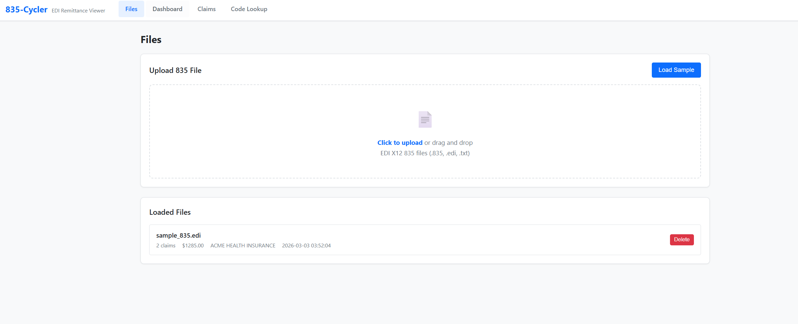
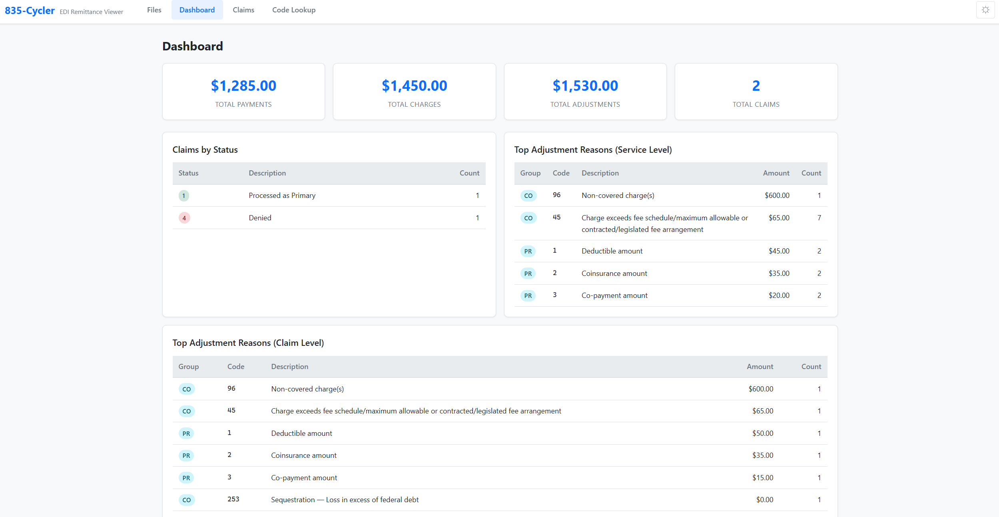
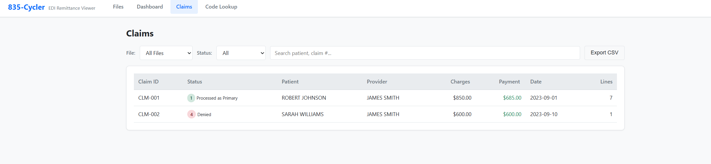

# 835-Cycler

EDI X12 835 Remittance Advice Viewer. Upload and parse 835 files, browse claims, look up adjustment codes, and export data.

## Features

- **File Upload** — Parse EDI X12 835 remittance files (.835, .edi, .txt)
- **Dashboard** — Payment totals, claim counts, and adjustment breakdowns at a glance
- **Claims Browser** — Filter and search claims by status, payer, date range
- **Claim Detail** — Service lines, adjustments, and provider info for each claim
- **Code Lookup** — Search CARC/RARC/claim status codes with descriptions
- **CSV Export** — Export claim data for use in spreadsheets

## Screenshots





## Quick Start

### Docker (recommended)

```bash
docker compose up --build
```

Open [http://localhost:8000](http://localhost:8000)

### Local

Requires Python 3.13+

```bash
pip install -r requirements.txt
python run.py
```

Open [http://localhost:8000](http://localhost:8000)

## Tech Stack

- **Backend** — Python, FastAPI, SQLite
- **Frontend** — Vanilla HTML/CSS/JS (no frameworks)
- **Parser** — Custom state-machine EDI X12 835 parser
